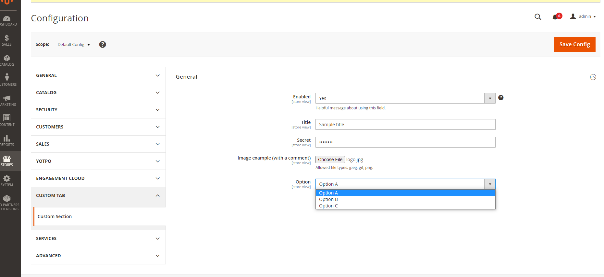
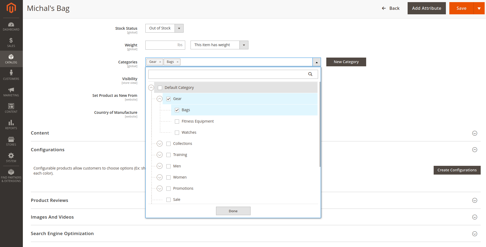
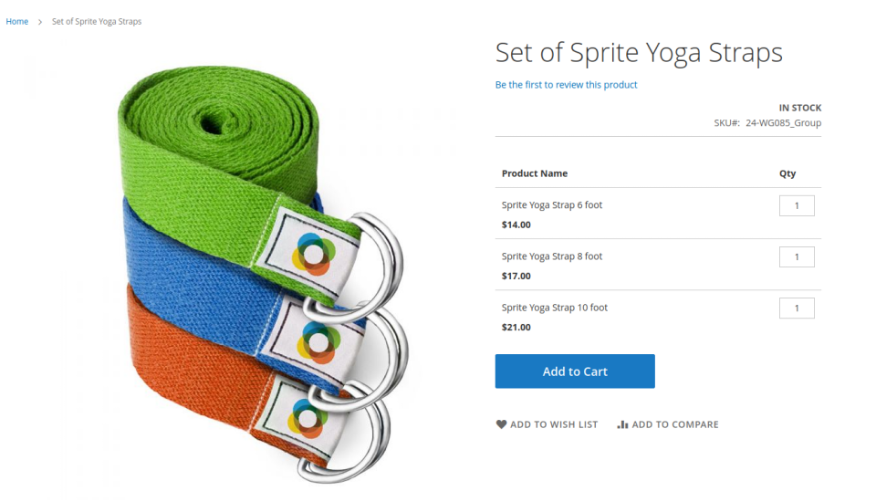
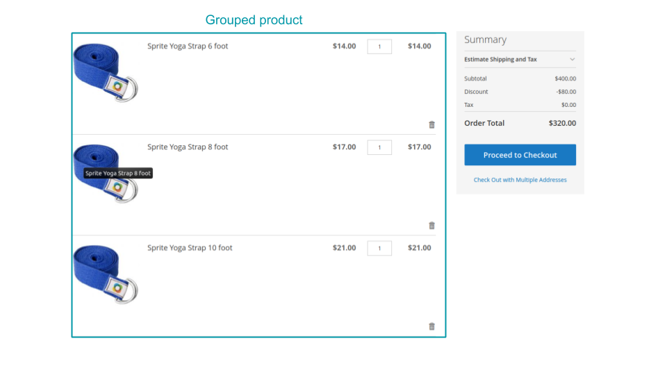
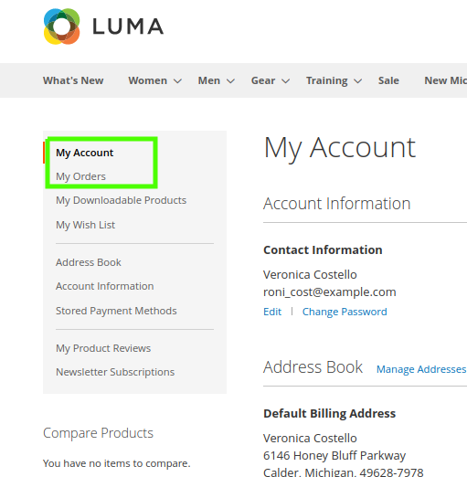
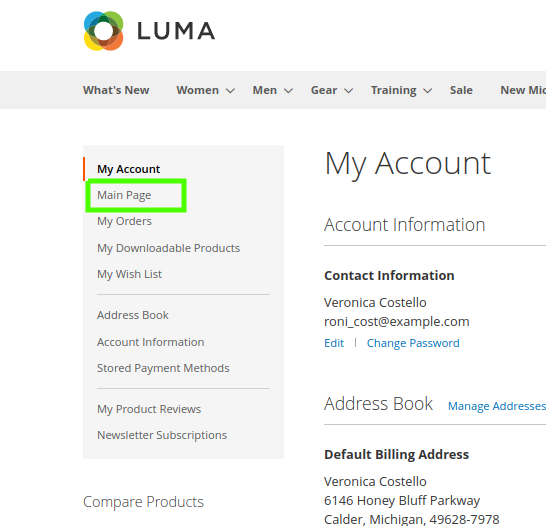

- old [Exam Study Guide: Magento 2 Certified Associate Developer](https://magento-u.magento.com/magento-u/downloads/M2%20Cert%20Assoc%20Dev%20Exam%20v2_3%20Study%20Gd.pdf)
- new [Exam Guide: Adobe Certified Professional - Magento Commerce Developer (AD0-E702)](https://spark.adobe.com/page/ClHLYMaUjTUfa/)

Chapters
###### [1. Magento Architecture and Customization Techniques](#contents-1)
###### [2. Request Flow Processing](#contents-2)
###### [3. Customizing the Magento UI](#contents-3)
###### [4. Working with Databases in Magento](#contents-4)
###### [5. Developing with Adminhtml](#contents-5)
###### [6. Customizing Magneto Business Logic](#contents-6)

<a name="contents-1"></a>
## 1 Magento Architecture and Customization Techniques
### [1.1 Describe the Magento module-based architecture](#11)
**Describe module architecture.** What are the significant steps to add a new module? What are the different Composer package types? When would you place a module in the app/code folder versus another location? 
### [1.2 Describe the Magento directory structure](#12)
**Describe the Magento directory structure.** What are the naming conventions, and how are namespaces established?
How can you identify the files responsible for some functionality? 
### [1.3 Utilize configuration and configuration variables scope](#13)
**Determine how to use configuration files in Magento.** Which configuration files are important in the development cycle?  
**Describe development in the context of website and store scopes.** How do you identify the configuration scope for a given variable? How do native Magento scopes (for example, price or inventory) affect development and decision-making processes?  
**Demonstrate an ability to add different values for different scopes.** How can you fetch a system configuration value programmatically? How can you override system configuration values for a given store using XML configuration?
### [1.4 Demonstrate how to use dependency injection (DI)](#14)
**Demonstrate the ability to use the dependency injection concept in Magento development.** How are objects realized in code? Why is it important to have a centralized object creation process?  
**Identify how to use DI configuration files for customizing Magento.** How can you override a native class, inject your class into another object, and use other techniques available in di.xml(for example,virtualTypes)?  
**Given a scenario, determine how to obtain an object using the ObjectManager object.** How would you obtain a class instance from different places in the code?
### [1.5 Demonstrate ability to use plugins](#15)
**Demonstrate an understanding of plugins.** How are plugins used in core code? How can they be used for customizations?
### [1.6 Configure event observers and scheduled jobs](#16)
**Demonstrate how to create a customization using an event observer.** How are observers registered? How are they
scoped for frontend or backend? How are automatic events created, and how should they be used? How are scheduled
jobs configured?
### [1.7 Utilize the CLI](#17)
**Describe the usage of `bin/magento` commands in the development cycle.** Which commands are available? How
are commands used in the development cycle?
### [1.8 Describe how extensions are installed and configured](#18)
How would you install and verify an extension by a customer’s request?

### [1.1](#contents-1) 
#### Describe module architecture.
The Magento modularity approach makes the code clearer. It allows you to simplify the development process and the process of identifying and correcting defects.

A module provides specific product features by implementing new functionality or extending the functionality of other modules. Each
module is designed to function independently, so the inclusion or exclusion of a particular module does not impact the functionality of
other modules. This maximizes flexibility when customizing a site.
While modules primarily define new business features, or customizations to existing ones, they can also define a default user interface
for those features, which are customizable by themes.
#### What are the significant steps to add a new module?
1. create new directory in app/code `app/code/<Vendor>/<ModuleName>/`
2. create file module.xml in `app/code/<Vendor>/<ModuleName>/etc/`, which should contain module's name and optionally its dependencies
3. create file registration.php in `app/code/<Vendor>/<ModuleName>/` for autoloading classes inside module directory

#### What are the different Composer package types?
Modules are usually located in Magento 2 vendor directory. The directory has the following format: `vendor / <vendor> / <type> – <module-mame>` where <type> can be assigned to one of the values below:

- module – for modules (module-customer-import-export)
- theme – for interfaces and administrators (theme-frontend-luma or theme-adminhtml-backend)
- language – for language packs (language de_de)

source: [amasty](https://amasty.com/blog/magento-2-certification-module-based-architecture/)
#### When would you place a module in the app/code folder versus another location? 
The `app/code` directory is right place for custom module (i.g. new functionality, Magento functionality customization). 
The third party modules (e.g. paid extensions) and Magento core modules should be placed in `vendor/` directory. 

### [1.2](#contents-1) 
#### Describe the Magento directory structure.

##### Magento 2 directory structure
Magento 2 directory structure consists of the following general directories:

- `app` – is used for additional elements; as a rule, app contains the following subdirectories:
    - `code` – contains the installed modules;
    - `design` – contains the installed themes. The frontend themes are located at the frontend folder; themes for admin panel – in the adminhtml folder;
    - `etc` – contains the Magento 2 configuration files;
    - `i18n` – contains the installed language packs.
- `bin` – contains Magento file responsible for the execution of CLI-commands in Magento 2.
- `dev` – contains Integration and Functional test files.
- `generated` – utilized for generated classes in Magento 2.
- `lib` – contains Magento 2 libraries and non-module based code.
- `phpserver` – contains Router.php file, implemented to realize the built-in PHP server.
- `pub` – used for static files storage:
    - `errors` – contains files responsible for displaying errors in the browser (this behavior is by default disabled);
    - `media` – contains all media-files from the website;
    - `static` – contains the generated theme and module files.
- `var` – contains temporary files, like:
    - `cache` – contains all the cached objects, except for pages;
    - `composer_home` – root directory of the installation wizard;
    - `log` – stores Magento 2 logs;
    - `page_cache` – contains pages cached with Full Page Cache;
    - `view_preprocessed` – contains minified templates and compiled LESS.
- `vendor` – contains core files of Magento 2. Moreover, this directory can contain the additionally installed modules. You should perform operations with components from this directory via Composer.

##### Magento 2 module catalog structure
In Magento 2, modules are located either in app/code or in vendor folders. The latter usually contains the built-in modules, while the additional ones are installed in the `app/code`. This is the path to the modules from `app/code`: `app/code/{Vendor_Name}/{Module_Name}`. The path to modules from vendor folder, on the other hand, depends on the configuration from **composer.json** module file.

It is recommended to name the modules the following way: `vendor/{Vendor_Name}/module-{Module_Name}`; however, certain modules do not conform with the rules, for instance – `vendor/magento/framework`.

Magento 2 module catalog directory in differs from module to module. These are the most common elements of this directory structure:

- `Api` – contains class interfaces for working with Magento 2 via API.
- `Block` – contains classes responsible for preparing data for their further display through templates to users of the site. The content of almost any Magento 2 page is displayed via block classes. There are blocks in the Adminhtml folder used for information display in the administrative panel of Magento 2.
- `Console/Command` – contains classes responsible for console commands execution on Magento 2 (via `php bin/magento`). Common url controller template in Magento 2 looks the following way: {Front_Name}/{Controller_Name}/{Action_name}. The {Front_Name} part is defined in the module route.xml file, while the classes in the Controller folder are located in the subfolders according to the left part of the template: {Controller_Name}/{Action_name}. Controllers of the admin part of the site are located in the subfolder Adminhtml.
- `Cron` – contains classes that are used to launch cron-tasks.
- `CustomerData` – contains section classes in Magento 2. Sections are the data in the key-value form, stored in the browser Local Storage, used to store user personal info. The info is loaded via ajax, allowing to use Full Page Cache for every page, which increases page loading speed.
- `etc` – the core folder of the module that contains a mandatory module file module.xml, different module configuration files, description of the implemented classes, paths, APIs and so on.
- `Helper` – contains additional classes with a general functionality, utilized further in different parts of the module.
- `i18n` – contains CSV-files for module localization.
- `Model` – contains model classes. Models are responsible for working with databases – they export / import information from the database and process it.
- `Observer` – contains observers-classes that react to various events (for instance, order creation) for implementation of some additional activities.
- `Plugin` – contains plugin classes that can alter the behavior of public methods of other Magento 2 classes.
- `Setup` – contains classes that perform any actions with the database during the installation or upgrade process. For example, the InstallSchema and InstallData classes are used when upgrading a module to create tables and fill them, respectively. The classes UpgradeSchema and UpgradeData are used when upgrading the module to update the structure of the tables and the data they contain. The Recurring and RecurringData classes are used to perform any actions after installing another module, i.e. one module performs certain actions with the database after another module has been installed. For example, the Magento_Indexer module, which checks for the presence of new indexers after installing other modules.

##### Magento 2 theme catalog structure
Themes in Magento 2 are located at the following path: `app/design/{area}/{Vendor_Name}/{Theme_Name}`. Themes for the admin panel are located in the adminhtml folder, and for the frontend – in the frontend Magento folder. A theme, as a rule, contains the following directories:

- `{Vendor_Name} _ {Module_Name}` – contains files that override other Magento 2 files or other modules files. The internal structure of such directories fully corresponds to the views/{area} directory structure of the module that it overrides.
- `etc` – contains theme configuration files.
- `media` – contains theme media files.
- `web` – contains CSS / JS / fonts theme files.

#### What are the naming conventions, and how are namespaces established?
The naming of classes and namespaces in Magento 2 conforms to the PSR-4 standard. 
Each class is located in a separate file and is declared in the namespace corresponding to a pattern of the type: 
{Vendor} \ {Module} \ {Path_1} \ … \ {Path_N}, where each {Path_N} corresponds to a specific folder containing the class file. 
The class names themselves correspond to the StudlyCaps notation.

#### How can you identify the files responsible for some functionality? 
When searching for certain class files, remember that each class is in a separate file and the class namespace fully corresponds to the directory structure in which the file of this class is located. 
The configuration file of the di.xml module (`etc/di.xml`), which contains a list of the various module classes, can help you. To search for block files, you can use layout files from 
the module’s `view / {area} / {layout}` directory. You can also use the Template Path Hints tool to search for blocks and their associated template files.

source [belvg](https://belvg.com/blog/magento-2-directory-module-theme-catalogue-structure.html)

### [1.3](#contents-1) 
#### **Determine how to use configuration files in Magento.** Which configuration files are important in the development cycle?  
Magento looks for configuration files in each module's `etc/` directory.
Configuration files that are in the top level of that module’s etc directory are global to that component (module).
Configuration files placed in subdirectories (adminhtml, frontend, webapi_rest, webapi_soap) apply only to those respective functional areas. 
Additions you make to files in these directories override the settings in the global configuration files for the respective functionality only. 
That is, if you add a config.xml file to etc/frontend, the settings you make in that file overrides the settings in etc/config.xml for storefront functionality only.

The following files are generated during the Magento 2 setup. You can change them directly editing the file. However, running terminal commands bin/magento is considered to be best practice.
- app/etc/config.php — contains the declaration of all modules;
- app/etc/env.php — describes the array, which contains the front end name for the back end panel, the data for connection to the database, the table prefixes, the current store mode, the types and statuses of the cache.

 Other config files:
- etc/config.xml — contains default option values from Stores > Configuration in the admin panel menu. This menu can be configured at system.xml;
- di.xml — contains configurations for the dependency injection;
- etc/events.xml — a list of observers and events;
- etc/routes.xml — a list of routers;
- etc/config.xml — contains the default values for the module settings Stores > Configuration;
- etc/acl.xml — adds module resources to a resource tree that allows you to configure access for different users.
- etc/crontab.xml — adds and configures the task for the cronjob;
- etc/module.xml — announces the name and the version of the module, as well as its dependencies on other modules;
- etc/widget.xml — stores the widget settings;
- etc/indexer.xml — announces a new kind of indexing. It specifies the view_id parameter, which points at the views described in etc/mview.xml;
- etc/mview.xml —  describes the representations of all the indices described in etc/indexer.xml;
- etc/webapi.xml — defines web API components, which service method to use and which resource to connect for a specific request;
- etc/view.xml — contains the properties of product images;
- etc/product_types.xml — describes types of products in a store;
- etc/product_options.xml — describes the types of options, that can have products and classes to render them;
- etc/extension_attributes.xml — a new ability to add a custom attribute appeared in Magento 2. This file describes the attribute, its type, which can be simple or complex and represent an interface;
- etc/catalog_attributes.xml — groups attributes;
- etc/adminhtml/system.xml — can only apply to the admin area, adds tabs to Stores > Configuration, describes sections and fields of a form;
- etc/adminhtml/menu.xml — can only apply to the admin area, adds an item to the admin panel menu.
#### **Describe development in the context of website and store scopes.** How do you identify the configuration scope for a given variable?
Find variable (by `path`) in database table `core_config_data` and check for given record values in column `scope` and `scope_id`
Get Scope for value from code, sth. like:
``
$config = $this->scopeConfig->getValue('path');
$config->getValue();
``
#### How do native Magento scopes (for example, price or inventory) affect development and decision-making processes?  
:thinking: 
- system.xml showInDefault, showInWebsite, showInStore
- native Magento scopes: only default scopes are used for price and inventory, that makes configs apply to all stores and websites
- when creating new module that override configs for price and inventory it is required to add new `config.xml` file for changing values for global scope (`default`) or 
creating nodes <websites> or <stores> to make different values for different scopes programmatically
#### **Demonstrate an ability to add different values for different scopes.** 
- screens with admin configs (circle scope input) for 2 different stores and 2 websites and db records
- find in code how are values for 'core_config' saved and parameter for scopes
:thinking:
#### How can you fetch a system configuration value programmatically?

```php
<?php

namespace CompanyName\ModuleName\Service;

use Magento\Framework\App\Config\ScopeConfigInterface;

class ClassName
{
    /** @var ScopeConfigInterface */
    private $scopeConfig;
    
    public function __construct(ScopeConfigInterface $scopeConfig)
    {
        $this->scopeConfig = $scopeConfig;
    }

    public function methodName()
    {
        return $this->scopeConfig->getValue('path');
    }
}
```

####  How can you override system configuration values for a given store using XML configuration?
create custom file `config.xml` in Vendor/ModuleName/etc/adminhtml/
:thinking:
- example config.xml
Sources:
- [Magento Docs: Define your configuration files](https://devdocs.magento.com/guides/v2.4/extension-dev-guide/build/required-configuration-files.html)
- [belvg](https://belvg.com/blog/configuration-files-and-variables-scope-in-magento-2.html)

### [1.4](#contents-1) 
#### **Demonstrate the ability to use the dependency injection concept in Magento development.** How are objects realized in code? 
- ObjectManager
- Dependency Injection
Since dependency injection happens automatically through the constructor, Magento must handle class creation - either at the time of injection or via a factory.
example:
```php
<?php
namespace CompanyName\ModuleName\Controller\Adminhtml\Example;

use CompanyName\OtherModuleName\Service\Custom;

private $customService;

public function __construct(
Custom $customService
) {
$this->customService = $customService;
}
```
:thinking:
more about direct injecting class, vs using factory (1 more example)
#### Why is it important to have a centralized object creation process?  
Having a centralised process to create objects makes testing much easier. It also provides a simple interface to substitute objects as well as modify existing ones.
Moreover, it gives you a possibility to avoid the inheritance, which means that applications become more flexible. In this, you don’t need to think about the child classes when changing the parent one.
#### **Identify how to use DI configuration files for customizing Magento.** How can you override a native class, inject your class into another object, and use other techniques available in di.xml(for example,virtualTypes)?  
##### Overriding Native Classes
Preferences are used to substitute entire classes. They can also be used to specify concrete classes for interfaces:
```XML
<preference for="Magento\GoogleTagManager\Block\ListJson"
            type="YourCompany\YourModule\Path\To\Your\Class"
/>
```

##### Injecting Your Class into Other Objects
Specify a `<type>` entry with your class as an `<argument>`:
```XML
<type name="Path\To\Your\Class\To\Inject\Into">
    <arguments>
        <argument xsi:type="object">
            Path\To\Your\Injected\Class
        </argument>
    </arguments>
</type>
```

##### Virtual Types
A virtual type allows you to create an instance of an existing class that has custom constructor arguments. This is useful in cases where you need a “new” class only because the constructor arguments need to be changed. This is used frequently in Magento to reduce redundant PHP classes.

#### **Given a scenario, determine how to obtain an object using the ObjectManager object.** How would you obtain a class instance from different places in the code?
:thinking:
- factory vs static OM call
- shared vs new object

Different places in the code: Blocks, Models, Helpers etc.

Source: [github.com/pykettk/magento2-developer-exam-notes](https://github.com/pykettk/magento2-developer-exam-notes)

### [1.5](#contents-1)  
:thinking:
#### **Demonstrate an understanding of plugins.** How are plugins used in core code? 
Plugins are the implementation of the Interception pattern. Object Manger checks if there are any plugins registered
for class, if so then use Interceptor instead of this class, wraps methods from given class and execute methods 
declared in Plugins before, after or instead of base class methods.
#### How can they be used for customizations?

First of all, the plugin need to be defined in modules `di.xml` file like in following pattern:
```xml
<config>
    <type name="{ObservedType}">
      <plugin name="{pluginName}" type="{PluginClassName}" sortOrder="1" disabled="false" />
    </type>
</config>
```
Then programmer have to create class in modules `Plugin` directory, and implement one (or any amount of them) of methods:
- **after-listener method**: change the values returned by an original method 
```php
<?php
namespace My\Module\Plugin;

class ProductAttributesUpdater
{
    public function afterGetName(\Magento\Catalog\Model\Product $subject, $result)
    {
        return '|' . $result . '|';
    }
}
```
- **around-listener method**: replace the original method
```php
<?php
namespace My\Module\Plugin;

class AuthLogger
{
    private $logger;

    public function __construct(\Psr\Log\LoggerInterface $logger)
    {
        $this->logger = $logger;
    }

    /**
     * @param \Magento\Backend\Model\Auth $authModel
     * @param null $result
     * @param string $username
     * @return void
     * @SuppressWarnings(PHPMD.UnusedFormalParameter)
     */
    public function afterLogin(\Magento\Backend\Model\Auth $authModel, $result, $username)
    {
        $this->logger->debug('User ' . $username . ' signed in.');
    }
}
```
- **before-listener method**: change the arguments of original method
```php
class WebsitesLogger
{
    private $logger;

    public function __construct(\Psr\Log\LoggerInterface $logger)
    {
        $this->logger = $logger;
    }

    public function afterUpdateWebsites(\Magento\Catalog\Model\Product\Action $subject, $result, $productIds, $websiteIds)
    {
        $this->logger->log('Updated websites: ' . implode(', ',  $websiteIds));
    }
}
```
---
All listener methods (beforeMethod, afterMethod, aroundMethod) must be created in the convention:
``prefix + method name with the capital first letter``, e.g.
for method ``save()`` before listener should be ``beforeSave()``
---

### [1.6](#contents-1)
### How are observers registered? 
Observers are registered in `eventes.xml` file in directory `etc` of each module that use them.
Observer class should be placed in modules `Observer/` directory. They must implements 
`Magento\Framework\Event\ObserverInterface` so method `execute` must be implemented to
 
```php
namespace MyCompany\MyModule\Observer;

use Magento\Framework\Event\ObserverInterface;

class MyObserver implements ObserverInterface
{
  public function __construct()
  {
    // Observer initialization code...
    // You can use dependency injection to get any class this observer may need.
  }

  public function execute(\Magento\Framework\Event\Observer $observer)
  {
    // Observer execution code...
  }
}
```
Observers have got possibility to use data passed by parameters (defined while dispaching event)
```php
namespace MyCompany\MyModule\Observer;

use Magento\Framework\Event\ObserverInterface;

class AnotherObserver implements ObserverInterface
{
  public function __construct()
  {
    // Observer initialization code...
    // You can use dependency injection to get any class this observer may need.
  }

  public function execute(\Magento\Framework\Event\Observer $observer)
  {
    $myEventData = $observer->getData('myEventData');
    // Additional observer execution code...
  }
}

```
### How are they scoped for frontend or backend?
For sake of performance and neat catalog structure the `events.xml` file should be placed in subdirectory of `etc` 
directory related to areas, for `frontend` area in `etc/frontend/`, for `backend` are in `etc/adminhtml/` . Thanks to such a procedure 
events declared only in given area will be executed on loading application. 

### How are automatic events created, and how should they be used?
:thinking: 

---
    automatic events, if that concerns to magento built-in plgins, modify this chapter and move events description 
    to ### **Demonstrate how to create a customization using an event observer**
    https://belvg.com/tutorial/magento-2-certified-professional-developer-guide-section-1#step_32
---	
Events can be triggered by injecting `Magento\Framework\Event\ManagerInterface` to custom classes contructors 
and calling method `dispatch`. As the first argument of that method is an event name and the second (optional) 
parameter is array of data that can by provided to Observer.

```php
namespace MyCompany\MyModule;
   
   use Magento\Framework\Event\ManagerInterface as EventManager;
   
   class MyClass
   {
     /**
      * @var EventManager
      */
     private $eventManager;
   
     /*
      * @param \Magento\Framework\Event\ManagerInterface as EventManager
      */
     public function __construct(EventManager $eventManager)
     {
       $this->eventManager = $eventManager;
     }
   
     public function something()
     {
       $eventData = null;
       // Code...
       $this->eventManager->dispatch('my_module_event_before');
       // More code that sets $eventData...
       $this->eventManager->dispatch('my_module_event_after', ['myEventData' => $eventData]);
     }
   }
```
Events are subscribed to Obersvers in `events.xml` file
```xml
<?xml version="1.0"?>
<config xmlns:xsi="http://www.w3.org/2001/XMLSchema-instance" xsi:noNamespaceSchemaLocation="urn:magento:framework:Event/etc/events.xsd">
    <event name="{eventName}">
        <observer name="observerName" instance="{Observer/Path}" />
    </event>
</config>

```
- `shared` - default is `false`, so new object of Observer class is created for each request, to avoid instantiation class for each request
the parameter should be set for `true`:  
```xml
<observer name="observerName" instance="{Observer/Path}" shared="true" />
```
- `disabled` - when observer isn't used any more it should be disabled, it is better practise than overriding it
```xml 
<observer name="observerName" instance="{Observer/Path}" diabled="true" />
```  

:thinking: Check how `shared` works in code

Observer names must be unique per event definition, like in the example bellow:  
```xml
<?xml version="1.0"?>
<config xmlns:xsi="http://www.w3.org/2001/XMLSchema-instance" xsi:noNamespaceSchemaLocation="urn:magento:framework:Event/etc/events.xsd">
    <event name="my_module_event_before">
        <observer name="myObserverName" instance="MyCompany\MyModule\Observer\MyObserver" />
    </event>
    <event name="my_module_event_after">
        <observer name="myObserverName" instance="MyCompany\MyModule\Observer\AnotherObserver" />
    </event>
</config>
```
### How are scheduled jobs configured?

To demonstrate how to configure a scheduled job, we create in the module a `crontab.xml` file with the similar content:
```xml
<?xml version="1.0" encoding="UTF-8"?>
<config xmlns:xsi="http://www.w3.org/2001/XMLSchema-instance" xsi:noNamespaceSchemaLocation="urn:magento:module:Magento_Cron:etc/crontab.xsd">
    <group id="default">
        <job name="my_module_cron_job" instance="Vendor\Module\Model\Cron" method="run">
            <!-- Use schedule or config_path, not both -->
            <schedule>0 * * * *</schedule>
            <config_path>my_module/my_group/my_setting</config_path>
        </job>
    </group>
</config>
```
Element `<job>` contains following attributes:
- `name` (name of the job),
- `instance` (job class name),
- `method` (job method name in the class)
Inside `<job>` element you can put elements:
- `<schedule>` - time offset to execute jobs in cron format [http://www.nncron.ru/help/EN/working/cron-format.htm](http://www.nncron.ru/help/EN/working/cron-format.htm) 
- `<config_path>` - configuration path to the schedule value
Element `<group>` determines to which group cron jobs should be tied. Group is declared in `cron_groups.xml` file and contains group configurations. 
The events inside the group have a general queue, while several groups can be launched simultaneously. Example:
```xml
<?xml version="1.0" encoding="UTF-8"?>
<config xmlns:xsi="http://www.w3.org/2001/XMLSchema-instance" xsi:noNamespaceSchemaLocation="urn:magento:module:Magento_Cron:etc/cron_groups.xsd">
    <group id="default">
        <schedule_generate_every>15</schedule_generate_every>
        <schedule_ahead_for>20</schedule_ahead_for>
        <schedule_lifetime>15</schedule_lifetime>
        <history_cleanup_every>10</history_cleanup_every>
        <history_success_lifetime>60</history_success_lifetime>
        <history_failure_lifetime>4320</history_failure_lifetime>
        <use_separate_process>0</use_separate_process>
    </group>
</config>
```
[source: belvg](https://belvg.com/tutorial/magento-2-certified-professional-developer-guide-section-1#step_30)

### [1.7](#17)
#### **Describe the usage of `bin/magento` commands in the development cycle.** 
#### Which commands are available? 
#### How are commands used in the development cycle?

### [1.8](#18)
#### How would you install and verify an extension by a customer’s request?
##### by composer
- connect via ssh to server
- go to magento root directory
- composer require `vendor/name-of-extension`
(replace `vendor/name-of-extension` for extension you want to install)
- install module run command in magento root directory on server `php bin/magento setup:upgrade`

source: [amasty](https://amasty.com/docs/doku.php?id=magento_2:composer_user_guide)

##### upload files
- connect to server via FTP/SFTP client (WinSCP, Filezilla, Cyberduck, etc)

- unpack the .zip file you’ve downloaded;
    connect to the server where the website source folder is located with FTP/SFTP client (WinSCP, Filezilla, Cyberduck, etc);
    go to `upload` > `app` and upload the files from the `app` folder to the root app folder of your Magento website using
    ‘Merge’ upload mode. This way, your FTP/SFTP client will only add new files;
    connect to your Magento directory with SSH;
    
run the next commands:

- `php bin/magento setup:upgrade` - to install the extension;
- `php bin/magento setup:di:compile` - to compile the code;
- `php bin/magento setup:static-content:deploy` - to deploy static view files.

If you use the default or developer mode, you can skip the last 2 commands.

source: [amasty](https://amasty.com/improved-layered-navigation-for-magento-2.html)
``Faq`` > ``How to install Magento 2 Amasty extensions?``

<a name="contents-2"></a>
## 2 Request Flow Processing
### [2.1  Describe how to use Magento modes](#21)
Understand the pros and cons of using developer mode or production mode. How do you enable/disable maintenance mode?
### [2.2  Demonstrate the ability to create a frontend controller with different response types (HTML /  JSON /  redirect)](#22)
How do you identify which module/controller corresponds to a given URL? What would you do to create a given URL?
### [2.3  Demonstrate how to use URL rewrites for a catalog product view to a different URL](#23)
How is the user-friendly URL of a product or category defined? How can you change it? How do you determine which page corresponds to a given user-friendly URL?

### [2.1](#contents-2)  
#### Understand the pros and cons of using developer mode or production mode.  
##### Developer mode
* Pros  
Static files are generated in each request, so developer can see changes immediately. Displays errors in browser.
* Cons  
Decrease in performance, due to lack of static content caching, longer request execution time.

##### Production mode  
Errors are not displayed in browser, but logged into files, so end user is not able to see them.
* Pros  
High performance. Static files are cached.
* Cons  
Its not friendly for development, because every change in static files require to run `bin/magento setup:static-content:deploy` to see changes, which is time consuming process.

##### Default mode
This mode is set by default durig the initial Magento instalation.
Errors are not displayed in browser, but logged into files. Static files are generated on the fly, and cached.  
* Cons  
The mode is not suitable for production server, because generating static files in each request makes an impact on performance.

[belvg: The pros and cons of using developer mode/production mode](https://belvg.com/blog/utilizing-modes-and-application-initialization-in-magento-2.html#par_4)

#### How do you enable/disable maintenance mode?  
```
bin/magento maintenance:enable
bin/magento maintenance:disable
```

### [2.2](#contents-2)  
### Demonstrate the ability to create a frontend controller with different response types (HTML /  JSON /  redirect)

* Page Result (\Magento\Framework\View\Result\Page) is the most common type of response. By returning this object, the controller starts the standard page rendering based on the corresponding XML layout handle.

```php
public function __construct(
   $pageFactory Magento\Framework\View\Result\PageFactory
) {
   $this->pageResultFactory = $pageFactory;
}
public function execute()
{
   return $this->pageResultFactory->create();
}
```

* JSON Result (\Magento\Framework\Controller\Result\Json) allows you to return a response in JSON format. It can be used in API or AJAX requests.

```
public function __construct(
   Magento\Framework\Controller\Result\JsonFactory $jsonResultFactory,
) {
   $this->jsonResultFactory = $jsonResultFactory;
}
public function execute()
{
   $result = $this->jsonResultFactory();
   $class = new Class;              
   $class->data = value;
   $result->setData($class);
   return $result;              
}
```

* Raw Result (\Magento\Framework\Controller\Result\Raw) is used if you want to return a string to the browser without using Magento layout and view rendering.

```
public function __construct(
   Magento\Framework\Controller\Result\Raw $rawResultFactory ,
) {
   $this->rawResultFactory = $rawResultFactory;
}
public function execute()
{
   $result = $this->rawResultFactory->create();
   $result->setHeader('Content-Type', 'text/xml');
   $result->setContents('<root><block></block></root>);
   return $result;
}
```

* Forward Result (\Magento\Framework\Controller\Result\Forward) allows to call another method/controller without changing the URL or redirecting.

```
public function __construct(
   Magento\Framework\Controller\Result\ForwardFactory $resultForwardFactory    
) {
   $this->resultForwardFactory = $resultForwardFactory;
}
public function execute()
{
   $result = $this->resultForwardFactory->create();
   $result->forward('noroute');    
   return $result;
}
public function __construct(
   Magento\Framework\Controller\Result\ForwardFactory $resultForwardFactory    
) {
   $this->resultForwardFactory = $resultForwardFactory;
}
public function execute()
{
   $result = $this->resultForwardFactory->create();
   $result->forward('noroute');    
   return $result;
}
```

* Redirect Result (\Magento\Framework\Controller\Result\Redirect) is used when a user needs to be redirected to a different URL.

```
public function __construct(
   Magento\Framework\Controller\Result\RedirectFactory $resultRedirectFactory
) {
   $this->resultRedirectFactory = $resultRedirectFactory;
}
public function execute()
{
   $result = $this->resultRedirectFactory->create();
   $result->setPath('*/*/index');
   return $result;
}
public function __construct(
   Magento\Framework\Controller\Result\RedirectFactory $resultRedirectFactory
) {
   $this->resultRedirectFactory = $resultRedirectFactory;
}
public function execute()
{
   $result = $this->resultRedirectFactory->create();
   $result->setPath('*/*/index');
   return $result;
}
```
[source belvg](https://belvg.com/blog/controllers-routers-and-responses-in-magento-2.html)
#### How do you identify which module/controller corresponds to a given URL? 
url (route):  
``frontName\controllerName\actionName``  
`frontName` - the value of attribute `frontName` set in  `routes.xml` file  
`controllerName` - name of directory where controller class is placed  
`actionName` - name of class that extends `\Magento\Framework\App\Action\Action`  

##### example from official documentation:
- controller class - Learning\HelloPage\Controller\Page\View  
- routes.xml:  
```xml
<?xml version="1.0"?>
<!--
/**
* Copyright © 2016 Magento. All rights reserved. * See COPYING.txt for license details.
*/
-->
<config xmlns:xsi="http://www.w3.org/2001/XMLSchema-instance" xsi:noNamespaceSchemaLocation="urn:magento:framework:App/etc/routes.xsd">
    <router id="standard">
        <route id="learning" frontName="test">
            <module name="Learning_HelloPage" />
        </route>
    </router>
</config>
```
route:  
```
test/page/view
```  
[Magento Docs: Create a New Page](https://devdocs.magento.com/videos/fundamentals/create-a-new-page/)

#### What would you do to create a given URL?
1. create controller (class that extends `\Magento\Framework\App\Action\Action`) and implements `execute` method.
2. create routes.xml

### [2.3](#contents-2)
#### How is the user-friendly URL of a product or category defined? How can you change it? 
defined: URL key is generated from product's or category's name in hyphens separated format
change: Admin panel -> Products List -> Edit -> SEO -> change URL key input
similar for category  
#### How do you determine which page corresponds to a given user-friendly URL?
check any table in db (maybe product's, category's attribute) 

<a name="contents-3"></a>
## 3. Customizing the Magento UI
### [3.1 Demonstrate the ability to customize the Magento UI using themes](#31) 
**Demonstrate the ability to customize the Magento UI using themes.** When would you create a new theme? How do you define theme hierarchy for a project? 
### [3.2 Demonstrate an ability to create UI customizations using a combination of a block and template](#32)
How do you assign a template to a block? How do you assign a different template to a native block?
### [3.3 Identify the uses of different types of blocks](#33)
When would you use non-template block types?
### [3.4 Describe the elements of the Magento layout XML schema, including the major XML directives](#34)
How do you use layout XML directives in your customizations? How do you register a new layout file? 
### [3.5 Create and add code and markup to a given page](#35)
How do you add new content to existing pages using layout XML?


### [3.1](#contents-3)
Theme is a package of JS scripts, CSS styles and templates that contains in application design.
I would create new theme, when there is a need to introduce the custom design for page, for example custom navigation bar on top of all web subpages.
### [3.2](#contents-3)
I would create layout XML file, put <block> element in the middle of structure, where I want to attach the block and add attributes “class”  with path to class that renders data on backend for block and “template” with template file information in format Vendor_ModuleName::template_file_name.phtml assuming that template file is placed in directory view/frontend/templates inside module directory.
### [3.3](#contents-3)
When I want to override any existing Magento’s core class and there is no need to add new elements on frontend.
### [3.4](#contents-3)
It’s required to create new controller (class that extends Magento/Framework/App/Action/Action and overrides method execute()) and to create xml file for layout with convention moduleName_controllerNamespace_controllerName.xml
### [3.5](#contents-3)
How do you add new content to existing pages using layout XML?
I would find the existing XML layout file for page I want to extend, create new XML file, with the same name in directory view/frontend/templates inside module directory and add tag refferenceContainer or refferenceBlock to element any existing element.

<a name="contents-4"></a>
## 4 Working with Databases in Magento
### [4.1 Describe the basic concepts of models, resource models, and collections](#41)
What are the responsibilities of each of the ORM object types? How do they relate to one another?
### [4.2 Describe how entity load and save occurs](#42)
How do you use the native Magento save/load process in the development process?
### [4.3 Describe how to filter, sort, and specify the selected values for collections and repositories](#43)
How do you select a subset of records from the database?
### [4.4 Demonstrate an ability to use declarative schema](#44)
How do you add a column using declarative schema? How do you modify a table added by another module? How do you
delete a column? How do you add an index or foreign key using declarative schema? How do you manipulate data using
data patches? What is the purpose of schema patches?

ANSWERS
<a name="41"></a>
### [4.1](#contents-3)
Resource Model is a data persistence class. The role of it is to represent database table (or another storage entity) in codebase and perform operations on database for concrete entity (load, save).
Resource Models encapsulates storage related logic.
Model is a class that can be used to transfer data related to one entity in business logic. It has no knowledge about data persistence.
Models encapsulates storage independent business logic.
Collection is an aggregation of Model instances, that can be used for retrieving set of data from database, filtering them, sorting, paging and carry out other mass operations.

<a name="42"></a>
### [4.2](#contents-3)
There should be created instance of resource model or collection, than methods “save” or “load” can be directly called on these instances. Method “save” called on resource model instance need a model instance (not resource model) as an argument, while “load” method requires model instance, value of field basis on which data is retrieved from storage and field if is different than model id.
For call methods “load” and “save” on collection instance, there are no arguments required.
```php
<?php
use Vendor/Module/Model/ResourceModel/CollectionFactory;
…
private $collectionFactory;
__construct(CollectionFactory $collectionFactory){
$this->collectionFactory = $collectionFactory;
}
…
$collection = $this->collectionFactory->create();
// fetch a collection
$collection->load();
//make any changes on collection
$collection->save();
```
<a name="43"></a>
### [4.3](#contents-3)
```php
<?php
use Vendor/Module/Model/ResourceModel/CollectionFactory;
…
private $collectionFactory;
__construct(CollectionFactory $collectionFactory){
$this->collectionFactory = $collectionFactory;
}
…
$collection = $this->collectionFactory->create();
$collection->addFieldToFilter(
‘field_name’,
[‘eq’ => ‘field_value’]
);
```
<a name="44"></a>
### [4.4](#contents-4)
#### How do you add a column using declarative schema?
Create file db_schema.xml in custom module’s “etc” dir
```xml
<schema xmlns:xsi="http://www.w3.org/2001/XMLSchema-instance"
        xsi:noNamespaceSchemaLocation="urn:magento:framework:Setup/Declaration/Schema/etc/schema.xsd">    
    <table name="existing_table_name">
        <column xsi:type="varchar" name="new_column_name" nullable="false" length="100" comment="New Column Name"/>
    </table>

</schema>
```
Run ``bin/magento setup:upgrade``

#### How do you modify a table added by another module? 
* Adding column is the same as in previous point.
* To modify column type: create the same "column" node with different value of "type" attribute. **[That's it?:thinking:]** 
* In case of removing column added by other module, it is necessary to create new "column" node with disabled="true".
#### How do you delete a column?
Remove "column" node frome db_schema.xml.
#### How do you add an index or foreign key using declarative schema?
Add the index subnode to the table node
```xml
<schema xmlns:xsi="http://www.w3.org/2001/XMLSchema-instance"
                 xsi:noNamespaceSchemaLocation="urn:magento:framework:Setup/Declaration/Schema/etc/schema.xsd">
    <table name="declarative_table">
        <column xsi:type="int" name="id_column" padding="10" unsigned="true" nullable="false" comment="Entity Id"/>
        <column xsi:type="int" name="severity" padding="10" unsigned="true" nullable="false" comment="Severity code"/>
        <column xsi:type="text" name="title" nullable="false" length="255" comment="Title"/>
        <column xsi:type="timestamp" name="time_occurred" padding="10" comment="Time of event"/>
        <constraint xsi:type="primary" referenceId="PRIMARY">
            <column name="id_column"/>
        </constraint>
+       <index referenceId="INDEX_SEVERITY" indexType="btree">
+           <column name="severity"/>
+       </index>
    </table>
</schema>
```
Add the constraint subnode of type foreign to the table node
```xml
<schema xmlns:xsi="http://www.w3.org/2001/XMLSchema-instance"
                 xsi:noNamespaceSchemaLocation="urn:magento:framework:Setup/Declaration/Schema/etc/schema.xsd">
    <table name="declarative_table">
        <column xsi:type="int" name="id_column" padding="10" unsigned="true" nullable="false" comment="Entity Id"/>
        <column xsi:type="int" name="severity" padding="10" unsigned="true" nullable="false" comment="Severity code"/>
        <column xsi:type="varchar" name="title" nullable="false" length="255" comment="Title"/>
        <column xsi:type="timestamp" name="time_occurred" padding="10" comment="Time of event"/>
        <constraint xsi:type="primary" referenceId="PRIMARY">
            <column name="id_column"/>
        </constraint>
+       <constraint xsi:type="foreign" referenceId="FL_ALLOWED_SEVERITIES" table="declarative_table"
+               column="severity" referenceTable="severities" referenceColumn="severity_identifier"
+               onDelete="CASCADE"/>
    </table>
</schema>
```
Foreign keys can only be added to tables when both tables were created using a declarative schema (db_schema.xml).

#### How do you manipulate data using data patches?

A **data patch** is a class that contains data modification instructions. It is defined in a ``<Vendor>/<Module_Name>/Setup/Patch/Data/<Patch_Name>.php`` file and implements ``\Magento\Framework\Setup\Patch\DataPatchInterface``.

[Paul Meștereagă](https://paulmestereaga.com/how-to-create-a-product-attribute-using-data-patches-in-magento-2-3/)
```php
<?php

namespace VendorName\ModuleName\Setup\Patch\Data;

use Magento\Framework\Setup\ModuleDataSetupInterface;
use Magento\Framework\Setup\Patch\DataPatchInterface;
use Magento\Framework\Setup\Patch\PatchInterface;

class ExamplePatch implements DataPatchInterface
{
    /**
     * @var ModuleDataSetupInterface
     */
    private $moduleDataSetup;

    /**
     * ExamplePatch constructor.
     * @param ModuleDataSetupInterface $moduleDataSetup
     */
    public function __construct(ModuleDataSetupInterface $moduleDataSetup)
    {
        $this->moduleDataSetup = $moduleDataSetup;
    }

    public function apply()
    {
        $this->moduleDataSetup->startSetup();
        // manage data in database
        $this->moduleDataSetup->endSetup();
    }
    
    public static function getDependencies()
    {
        return [];
    }

    public function getAliases()
    {
        return [];
    }
}
```
run commands
```
php bin/magento setup:upgrade
php bin/magento cache:flush
```
#### What is the purpose of schema patches?

A **schema patch** contains custom schema modification instructions. These modifications can be complex. It is defined in a ``<Vendor>/<Module_Name>/Setup/Patch/Schema/<Patch_Name>.php`` file and implements ``\Magento\Framework\Setup\Patch\SchemaPatchInterface``.

Schema patch - A class that contains custom schema modification instructions. Schema patches are used along with declarative schema, but these patches allow complex operations such as:

* Adding triggers, stored procedures, functions
* Performing data migration with inside DDL operations
* Renaming tables, columns, and other entities
* Adding partitions and options to a table

<a name="contents-5"></a>
## 5 Developing with Adminhtml
### [5.1 Create a controller for an admin router](#51)
How would you create an admin controller? How do you ensure the right level of security for a new controller?
### [5.2 Define basic terms and elements of system configuration, including scopes, website, store, store view](#52)
:thinking:
How would you add a new system configuration option? What is the difference in this process for different option types
(secret, file)?
### [5.3 Define / identify basic terms and elements of ACL](#53)
How would you add a new ACL resource to a new entity? How do you manage the existing ACL hierarchy?
### [5.4 Set up a menu item](#54)
How do you add a new menu item to a given tab? How do you add a new tab to the Admin menu?
### [5.5 Create appropriate permissions for users](#55)
How are menu items related to ACL permissions? How do you add a new user with given set of permissions?

<a name="51"></a>
### [5.1](#contents-5)
#### How would you create an admin controller?
* create new class in custom module's directory in Controller/Adminhtml/Path/
* extends Magento\Backend\App\Action
* implement `execute` method
* create file `etc/adminhtml/routes.xml` in module directory with route for controller

```php
<?php
namespace VendorName\ModuleName\Controller\Adminhtml\Path;

class Index extends \Magento\Backend\App\Action

...

    public function execute()
    {
        // returns any result, eg. \Magento\Framework\View\Result\Page
    }

```

```xml
<?xml version="1.0"?>
<config xmlns:xsi="http://www.w3.org/2001/XMLSchema-instance" xsi:noNamespaceSchemaLocation="urn:magento:framework:App/etc/routes.xsd">
    <router id="admin">
        <route id="example" frontName="example">
            <module name="ModuleName" />
        </route>
    </router>
</config>
```
* :thinking: here I may add Page object injected by di, if so the command `setup:di:compile` is required
* :thinking: view layout -> bin/magento c:c

#### How do you ensure the right level of security for a new controller?

Override method `_isAllowed` method of class `\Magento\Framework\App\Action\Action` in custom controller. That method checks if logged in user has access to resource
on the basis of user's role set in Admin Panel.  

[Megento Docs: Restrict Admin Controllers](https://devdocs.magento.com/guides/v2.4/ext-best-practices/tutorials/create-access-control-list-rule.html#restrict-admin-controllers)
<a name="52"></a>
### [5.2](#contents-5)
#### How would you add a new system configuration option?  
1. Create `system.xml` in modules' directory `etc/adminhtml/`
```xml
<config xmlns:xsi="http://www.w3.org/2001/XMLSchema-instance" xsi:noNamespaceSchemaLocation="urn:magento:module:Magento_Config:etc/system_file.xsd">
    <system>
    ...
    </system>
</config>
 ```
* In the file above add element `tab`
* Add element `section` below.
* Inside `section` add element `group`.
* Inside `section` add element `tab` to assign tab to section.
* Inside `group` add element `field`.
 For `field` choose one type from [list](https://magento.stackexchange.com/a/215502/88113).
 
#### What is the difference in this process for different option types (secret, file)?
Different option types renders different html form elements, that vary in look and usage.  
For example option `type="obscure"` renders password input that covers letters with dots.  

Some fields type uses another elements like `upload_dir` for `type="image"` or `type="file"`.  
```xml
<field id="samplefile" type="file" translate="label" sortOrder="50" showInDefault="1" showInWebsite="1" showInStore="1">
    <label>File</label>
    <backend_model>Magento\Config\Model\Config\Backend\File</backend_model>
    <config_path>customModule/general/file</config_path>
    <upload_dir config="upload/" scope_info="1">logo</upload_dir>
</field>
```
Fields with `type="select"` needs select options that can be provided by class defined in element `source_model`.  

``Admin Panel -> Stores -> Configuration``

[inviqa](https://inviqa.com/blog/how-use-system-configuration-and-helpers-magento-2)
[atwix](https://www.atwix.com/magento-2/system-configuration/)

* Example

```xml
<?xml version="1.0"?>
<config xmlns:xsi="http://www.w3.org/2001/XMLSchema-instance" xsi:noNamespaceSchemaLocation="urn:magento:module:Magento_Config:etc/system_file.xsd">
    <system>
        <tab id="custom_tab" translate="label" sortOrder="1000">
            <label>Custom Tab</label>
        </tab>
        <section id="custom_section" translate="label" sortOrder="10" showInDefault="1" showInWebsite="1" showInStore="1">
            <label>Custom Tab</label>
            <tab>custom_tab</tab>
            <resource>Vendor_CustomModule::customAclResource</resource>
            <group id="general" translate="label" sortOrder="10" showInDefault="1" showInWebsite="1" showInStore="1">
                <label>General</label>
                <field id="enabled" type="select" translate="label,comment,tooltip" sortOrder="10" showInDefault="1" showInWebsite="1" showInStore="1">
                    <label>Enabled</label>
                    <source_model>Magento\Config\Model\Config\Source\Yesno</source_model>
                    <config_path>customModule/general/enabled</config_path>
                    <comment>Helpful message about using this field.</comment>
                    <tooltip>Longer helpful message about using this field.</tooltip>
                </field>
                <field id="title" type="text" translate="label" sortOrder="20" showInDefault="1" showInWebsite="1" showInStore="1">
                    <label>Title</label>
                    <validate>required-entry alphanumeric</validate>
                    <config_path>customModule/general/title</config_path>
                    <depends>
                        <field id="enabled">1</field>
                    </depends>
                </field>
                <field id="secret" type="obscure" translate="label" sortOrder="30" showInDefault="1" showInWebsite="1" showInStore="1">
                    <label>Secret</label>
                    <validate>required-entry</validate>
                    <backend_model>Magento\Config\Model\Config\Backend\Encrypted</backend_model>
                    <config_path>customModule/general/secret</config_path>
                    <depends>
                        <field id="enabled">1</field>
                    </depends>
                </field>
                <field id="option" type="select" translate="label" sortOrder="40" showInDefault="1" showInWebsite="1" showInStore="1">
                    <label>Option</label>
                    <source_model>CardinalHealth\CategoriesInstaller\Model\Config\Source\Option</source_model>
                    <config_path>customModule/general/option</config_path>
                    <depends>
                        <field id="enabled">1</field>
                    </depends>
                </field>
                <field id="logo" translate="label" type="image" sortOrder="30" showInDefault="1" showInWebsite="1" showInStore="1">
                    <label>Image example (with a comment)</label>
                    <backend_model>Magento\Config\Model\Config\Backend\Image</backend_model>
                    <upload_dir config="system/filesystem/media" scope_info="1">logo</upload_dir>
                    <base_url type="media" scope_info="1">logo</base_url>
                    <comment><![CDATA[Allowed file types: jpeg, gif, png.]]></comment>
                </field>
            </group>
        </section>
    </system>
</config>
```

<a name="53"></a>
### [5.3](#contents-5)
#### How would you add a new ACL resource to a new entity?  
* Admin Panel
Add in custom moudule file: `etc/adminhtml/acl.xml`
* Frontend
It looks like acl roles apply only to admin users.
#### How do you manage the existing ACL hierarchy?
1. Create new role in Admin Panel `System -> User Roles -> Add/Edit Role -> Role Resources`
2. Change `Roles Resources` from `All` to `Custom`
3. Check roles that will be permitted for users group.
4. Assign users for role.

<a name="54"></a>
### [5.4](#contents-5)
#### How do you add a new menu item to a given tab? 
* Admin Panel  
Add attribute `action` with route to method in controller in  `etc/adminhtml/menu.xml` in custom module (see [5.4](#54))
* Frontend  
Add menu widget  
[Magento Docs: Menu Widget](https://devdocs.magento.com/guides/v2.4/javascript-dev-guide/widgets/widget_menu.html)  
or  
[stackoverflow](https://magento.stackexchange.com/questions/206572/how-to-add-custom-link-in-main-menu-in-magento-2)  

[I am not sure if this is the best solution](https://linkstraffic.net/adding-custom-menu-item-inside-magento2/)
, but there is shown way, I was looking for somewhen, to reload styles without using `static content:deploy`
#### How do you add a new tab to the Admin menu?
Add in custom moudule file: `etc/adminhtml/menu.xml`
```xml
<?xml version="1.0"?>
<config xmlns:xsi="http://www.w3.org/2001/XMLSchema-instance" xsi:noNamespaceSchemaLocation="urn:magento:module:Magento_Backend:etc/menu.xsd">
    <menu>
      <add id="MyCompany_ExampleAdminNewPage::greetings" title="Greetings" translate="title" module="MyCompany_ExampleAdminNewPage" parent="Magento_Backend::content" sortOrder="50" dependsOnModule="MyCompany_ExampleAdminNewPage" resource="MyCompany_ExampleAdminNewPage::greetings"/>
      <add id="MyCompany_ExampleAdminNewPage::greetings_helloworld" title="Hello World" translate="title" module="MyCompany_ExampleAdminNewPage" parent="MyCompany_ExampleAdminNewPage::greetings" sortOrder="10" dependsOnModule="MyCompany_ExampleAdminNewPage" action="exampleadminnewpage/helloworld" resource="MyCompany_ExampleAdminNewPage::greetings"/>
    </menu>
</config>
```

```xml
<?xml version="1.0"?>
<config xmlns:xsi="http://www.w3.org/2001/XMLSchema-instance" xsi:noNamespaceSchemaLocation="urn:magento:module:Magento_Backend:etc/menu.xsd">
    <menu>
     <add id="Vendor_MyModule::menu" title="Custom Menu" module="Vendor_MyModule" sortOrder="10" resource="Vendor_MyModule::menu"/>
     <add id="Vendor_MyModule::view" title="View" module="Vendor_MyModule" sortOrder="30" parent="Vendor_MyModule::menu" action="custommenu/view/index" resource="Vendor_MyModule::view"/>
    </menu>
</config>
```
To see changes in Admin Panel run: ``bin/magento cache:clean``.  
The attribute `resource` is required only when restricting action with ACL rules.
* [Magento Docs: Creating Magento Admin Page](https://devdocs.magento.com/guides/v2.4/ext-best-practices/extension-coding/example-module-adminpage.html#routing-and-navigation)
* [Magento Docs: Restrict the admin menu](https://devdocs.magento.com/guides/v2.4/ext-best-practices/tutorials/create-access-control-list-rule.html#step-2-restrict-access-to-admin-users)

### [5.5](#contents-5)
#### How are menu items related to ACL permissions? 
In Admin Panel menu items' actions can be restricted by `resource` attribute that refers to ACL rule (see [5.4](#54)).  

#### How do you add a new user with given set of permissions?

Admin Panel
1. Create user role.
2. Assign resources that will be permitted for role.
3. Add user to role.  

[Magento Docs: User Roles](https://docs.magento.com/user-guide/system/permissions-user-roles.html)  

<a name="contents-6"></a>
## 6 Customizing Magneto Business Logic
### [6.1 Identify/describe standard product types (simple, configurable, bundled, etc.)](#61)
How would you obtain a product of a specific type, and what tools (in general) does a product type model provide?
### [6.2 Describe category properties in Magento](#62)
How do you create and manage categories?
### [6.3 Define how products are related to the category](#63)
How do you assign and unassign products to categories?
### [6.4 Describe the difference in behavior of different product types in the cart](#64)
How are configurable and bundle products rendered? How can you create a custom shopping cart renderer?
### [6.5 Describe native shipment functionality in Magento](#65)
How do you customize the shipment step of order management?
### [6.6 Describe and customize operations available in the customer account area](#66)
How would you add another tab in the “My Account” section? How do you customize the order history page?
### [6.7 Add or modify customer attributes](#67)
How do you add or modify customer attributes in a setup script?
### [6.8 Customize the customer address](#68)
How do you add another field to the customer address entity using a setup script?

<a name="61"></a>
### [6.1](#contents-6)
#### How would you obtain a product of a specific type, and what tools (in general) does a product type model provide?
###### Get products of specific type

```php
<?php
declare(strict_types=1);

namespace Cert\CustomizingMagentoBusinessLogic\Model\Product;

use Magento\Catalog\Api\Data\ProductInterface;
use Magento\Catalog\Model\ResourceModel\Product\CollectionFactory;

class Manager
{
    private $productRepository;
    private $searchCriteriaBuilder;
    private $productCollectionFactory;

    public function __construct(
        \Magento\Catalog\Api\ProductRepositoryInterface $productRepository,
        \Magento\Framework\Api\SearchCriteriaBuilder $searchCriteriaBuilder,
        CollectionFactory $collectionFactory
    ) {
        $this->productRepository = $productRepository;
        $this->searchCriteriaBuilder = $searchCriteriaBuilder;
        $this->productCollectionFactory = $collectionFactory;
    }

    public function getProductsList(string $type): array
    {
        $searchCriteria = $this->searchCriteriaBuilder
            ->addFilter(ProductInterface::TYPE_ID, $type)
            ->create();
        return $this->productRepository->getList($searchCriteria)->getItems();
    }

    /*
     * This way is not the best, because all products are loading and only after that result is limited to one
     */
    public function getFirstProductForGivenType(string $type): ProductInterface
    {
        $searchCriteria = $this->searchCriteriaBuilder
            ->addFilter(\Magento\Catalog\Api\Data\ProductInterface::TYPE_ID, $type)
            ->create();
        $items = $this->productRepository->getList($searchCriteria)->getItems();
        $arrayKeyFirst = array_key_first($items);
        return $items[$arrayKeyFirst];
    }

    /*
     * This way is better when getting only one product
     */
    public function getFirstProductForGivenTypeUsingCollection(string $type): ProductInterface
    {
        $collection = $this->productCollectionFactory->create();
        $collection->addFilter('type_id', $type);
        return $collection->getFirstItem();
    }
}
```

Product type model is represented by abstract class `\Magento\Catalog\Model\Product\Type\AbstractType` and
specific product types which extends it (eg. Conifgurable, Bundle, etc.) and is responsible for:
- force deleting data related to specific type (while product of given type is saved)
    ```php
    abstract public function deleteTypeSpecificData(\Magento\Catalog\Model\Product $product);
    ```
- geting details for product and its options 
    - methods:
    ``getOptionSku``
    ``getWeight``
    ``hasOptions``
    ``isPossibleBuyFromList``
    ``isSalable``
    ``checkProductBuyState``
    ``isComposite``
    ``canConfigure``
    ``canUseQtyDecimals``
    ``getSku``
    ``getAssociatedProducts``
- handling products options operations
    - methods:
    ``getChildrenIds``
    ``getParentIdsByChild``
    ``_prepareOptions`` 
    ``assignProductToOption``
    ``checkProductConfiguration``
- preparing product before adding to cart
    - methods:  
    ``_prepareProduct``
    ``processConfiguration``
    ``prepareForCartAdvanced``
    ``prepareForCart``
    ``checkProductConfiguration``
- checking if product is of the type `virtual`
- setting type related data before saving product in database
  method ``save``
  
  :thinking:
*- ``getRelationInfo``
*- ``getOrderOptions``
*- ``processFileQueue``
*- ``getIdentities``
*- ``setImageFromChildProduct``

<a name="62"></a>
### [6.2](#contents-6)
#### How do you create and manage categories?
- in Admin Panel
  `Catalog -> Categories`
  Only required property is name, all the rest attributes are added automatically
- in Code
    * create using: `\Magento\Catalog\Api\Data\CategoryInterfaceFactory`
    * save using: `\Magento\Catalog\Api\CategoryRepositoryInterface`
    Required: `name`, `is_active`

* `level` - specify how deep in category tree, given category is located
* `path` - specify place in categories tree
* `url key` - displays in a browser url bar, is generated from the category name

Categories are organized in tree structure.
Root categories and Subcategories are basically the same structure, only difference is that root category has no parent, 
beyond the main 'Root Category' with `entity_id=1`.
They are used to assigning categories to stores and are not visible for customers.
Subcategory refers to all the rest categories.  
Categories can be created, edited and deleted by admin panel as well as programmatically using `\Magento\Catalog\Api\CategoryRepositoryInterface`;

:thinking:
```
In PatchApplier.php line 288:
Cannot delete category with id 43
```

<a name="63"></a>
### [6.3](#contents-6)
There is the class in magento codebase ``\Magento\Catalog\Model\CategoryProductLink`` corresponding to 
links between products and categories.
For the same links magento persists table in database - ``catalog_category_product``
#### How do you assign and unassign products to categories?
- assign
```php
class AssignProductToCategory
{
    private const PRODUCTS_SKU = 'michals-bag';

    /** @var \Magento\Catalog\Api\CategoryLinkManagementInterface */
    private $linkManagement;
    
    public function __construct(
        CategoryLinkManagementInterface $linkManagement,
        CategoryLinkRepository $categoryLinkRepository
    ) {
        $this->linkManagement = $linkManagement;
    }

    public function assign(): void
    {
        $this->linkManagement->assignProductToCategories(self::PRODUCTS_SKU, [3, 4]);
    }
}

```

- unassign
```php
class UnassignProductFromCategory
{
    private const PRODUCTS_SKU = 'michals-bag';

    /** @var \Magento\Catalog\Model\CategoryLinkRepository */
    private $categoryLinkRepository;
    
    public function __construct(
        CategoryLinkRepository $categoryLinkRepository
    ) {
        $this->categoryLinkRepository = $categoryLinkRepository;
    }
    
    public function unassign(): void
    {
        $categoryIds = [3, 4];
        foreach ($categoryIds as $categoryId) {
            $this->categoryLinkRepository->deleteByIds($categoryId, self::PRODUCTS_SKU);
        }
    }
}
```

#### In admin panel


<a name="64"></a>
### [6.4](#contents-6)
#### How are configurable and bundle products rendered?
##### Simple, Configurable, Bundle Products
- **simple**: rendered as one, single item 
- **configurable**: rendered similar to simple product; product's name and image comes from a parent 
but under the name there are displayed details of chosen (one) option
- **bundle**: rendered as one line item with all chosen options under the name of parent (set)

##### Grouped Products
- while adding to cart  

- in the cart  
  **grouped products** are rendered split into separate items in the cart
  they don't have edit button or `Move to wishlist` link like others

      
#### How can you create a custom shopping cart renderer?
- create block that extends ``Magento\Checkout\Block\Cart\Item\Renderer``
- create file in new module ``view/frontend/layout/checkout_cart_item_renderers.xml`` to register
  custom renderer
  
Example: 
1. Renderer block
```php
<?php
declare(strict_types=1);

namespace Cert\CustomizingMagentoBusinessLogic\Block\Cart;

use Magento\Checkout\Block\Cart\Item\Renderer;

class CustomRenderer extends Renderer
{

}
```
2. Register renderer in config file `checkout_cart_item_renderers.xml`
   which is copy of `vendor/magento/module-configurable-product/view/frontend/layout/checkout_cart_item_renderers.xml`
   (with changed `name` of block renderer and product type in `as` attribute). 
   For changes in displaying product in cart any `template` can be overriden in custom module with own design rules.
```xml
<?xml version="1.0"?>
<page xmlns:xsi="http://www.w3.org/2001/XMLSchema-instance" xsi:noNamespaceSchemaLocation="urn:magento:framework:View/Layout/etc/page_configuration.xsd">
    <body>
        <referenceBlock name="checkout.cart.item.renderers">
            <block class="Cert\CustomizingMagentoBusinessLogic\Block\Cart\CustomRenderer" as="new_product_type" template="Magento_Checkout::cart/item/default.phtml">
                <block class="Magento\Checkout\Block\Cart\Item\Renderer\Actions" name="checkout.cart.item.renderers.custom.actions" as="actions">
                    <block class="Magento\Checkout\Block\Cart\Item\Renderer\Actions\Edit" name="checkout.cart.item.renderers.custom.actions.edit" template="Magento_Checkout::cart/item/renderer/actions/edit.phtml"/>
                    <block class="Magento\Checkout\Block\Cart\Item\Renderer\Actions\Remove" name="checkout.cart.item.renderers.custom.actions.remove" template="Magento_Checkout::cart/item/renderer/actions/remove.phtml"/>
                </block>
            </block>
        </referenceBlock>
    </body>
</page>

```

##### For testing purpose added new product type `new_product_type` following: [mageplaza: How to Create a New Product Type in Magento 2](https://www.mageplaza.com/devdocs/how-create-new-product-type-magento-2.html)
- register new product type in config file `app/code/Cert/CustomizingMagentoBusinessLogic/etc/product_types.xml`
```xml
<?xml version="1.0"?>
<config xmlns:xsi="http://www.w3.org/2001/XMLSchema-instance"
        xsi:noNamespaceSchemaLocation="urn:magento:module:Magento_Catalog:etc/product_types.xsd">
    <type name="new_product_type" label="New Product Type"
          modelInstance="Cert\CustomizingMagentoBusinessLogic\Model\Product\Type\NewProductType" indexPriority="60" sortOrder="80"
          isQty="true">
        <priceModel instance="Cert\CustomizingMagentoBusinessLogic\Model\Product\Price"/>
    </type>
</config>
```
- add new product type model 
```php
<?php
declare(strict_types=1);

namespace Cert\CustomizingMagentoBusinessLogic\Model\Product\Type;

use Magento\Catalog\Model\Product\Type\AbstractType;

class NewProductType extends AbstractType
{
    public function deleteTypeSpecificData(\Magento\Catalog\Model\Product $product)
    {
    }
}

```
- add price model
```php
<?php
declare(strict_types=1);

namespace Cert\CustomizingMagentoBusinessLogic\Model\Product;

use Magento\Catalog\Model\Product\Type\Price as TypePrice;

class Price extends TypePrice
{

}

```
<a name="66"></a>
### [6.6](#contents-6)
### How would you add another tab in the “My Account” section?

I will create tab "Main Page" on "My Account" menu between tabs "My Account" and "My Orders", which will link to 
the stores home page.



1. I have found layout files related to tabs "My Account" and "My Orders"
   `vendor/magento/module-customer/view/frontend/layout/customer_account.xml`

    ```xml
    ...
    <block class="Magento\Customer\Block\Account\SortLinkInterface" name="customer-account-navigation-account-link">
        <arguments>
            <argument name="label" xsi:type="string" translate="true">My Account</argument>
            <argument name="path" xsi:type="string">customer/account</argument>
            <argument name="sortOrder" xsi:type="number">250</argument>
        </arguments>
    </block>
    ...
    ```

   `vendor/magento/module-sales/view/frontend/layout/customer_account.xml`

    ```xml
    ...
    <block class="Magento\Customer\Block\Account\SortLinkInterface" name="customer-account-navigation-orders-link">
        <arguments>
            <argument name="path" xsi:type="string">sales/order/history</argument>
            <argument name="label" xsi:type="string" translate="true">My Orders</argument>
            <argument name="sortOrder" xsi:type="number">230</argument>
        </arguments>
    </block>
    ...
    ```

   they have `sortOrder` values: "My Account" - **250** and "My Orders" - **230**

2. I created layout file:
   `app/code/Cert/CustomizingMagentoBusinessLogic/view/frontend/layout/customer_account.xml`

```xml
<?xml version="1.0"?>
<body>
    <referenceContainer name="content">
        <referenceBlock name="customer_account_navigation">
            <block class="Magento\Customer\Block\Account\SortLinkInterface" name="main-page"
                   after="customer-account-navigation-account-link">
                <arguments>
                    <argument name="label" xsi:type="string" translate="true">Main Page</argument>
                    <argument name="path" xsi:type="string">/</argument>
                    <argument name="sortOrder" xsi:type="number">240</argument>
                </arguments>
            </block>
        </referenceBlock>
    </referenceContainer>
</body>

```

as you can see I set `sortOrder` to **240** and blocks `after` attribute to **customer-account-navigation-account-link**

After clearing layouts cache `bin/magento c:c layout` tab appears in menu:


### How do you customize the order history page?

Find layout file that is behind order history page (`vendor/magento/module-sales/view/frontend/layout/sales_order_history.xml`)  
and override it be creating file with the same name in your custom module in directory `view/frontend/layout/`

`app/code/Cert/CustomizingMagentoBusinessLogic/view/frontend/layout/sales_order_history.xml`

```xml
<?xml version="1.0"?>
<body>
    <referenceContainer name="content">
        <referenceBlock name="sales.order.history.info">
            <block template="Cert_CustomizingMagentoBusinessLogic::custom.phtml"/>
        </referenceBlock>
    </referenceContainer>
</body>
```

`app/code/Cert/CustomizingMagentoBusinessLogic/view/frontend/templates/custom.phtml`

```php
<?php
echo "<h2> Custom Content </h2>";
```

<a name="67"></a>
### [6.7](#contents-6)
#### How do you add or modify customer attributes in a setup script?
##### Add customer attribute (method `apply`) and remove (method `revert`) in following DataPatch
For this example we will create attribute `Hobby`
```php
<?php
declare(strict_types=1);

namespace Cert\CustomizingMagentoBusinessLogic\Setup\Patch\Data;

use Magento\Customer\Model\Customer;
use Magento\Customer\Model\ResourceModel\Attribute;
use Magento\Customer\Setup\CustomerSetupFactory;
use Magento\Framework\Setup\ModuleDataSetupInterface;
use Magento\Framework\Setup\Patch\DataPatchInterface;
use Magento\Framework\Setup\Patch\PatchRevertableInterface;

class AddCustomerCustomAttr implements DataPatchInterface, PatchRevertableInterface
{
    public const CUSTOM_CUSTOMER_ATTRIBUTE = 'hobby';
    /** @var CustomerSetupFactory */
    private $customerSetupFactory;

    /** @var ModuleDataSetupInterface */
    private $setup;

    /** @var Attribute */
    private $customerAttrResModel;

    /**
     * AddCustomerCustomAttr constructor.
     * @param CustomerSetupFactory $customerSetupFactory
     * @param ModuleDataSetupInterface $setup
     * @param Attribute $customerAttrResModel
     */
    public function __construct(
        CustomerSetupFactory $customerSetupFactory,
        ModuleDataSetupInterface $setup,
        Attribute $customerAttrResModel
    ) {
        $this->customerSetupFactory = $customerSetupFactory;
        $this->setup = $setup;
        $this->customerAttrResModel = $customerAttrResModel;
    }

    public function apply(): void
    {
        $attributeCode = self::CUSTOM_CUSTOMER_ATTRIBUTE;
        $customerSetup = $this->customerSetupFactory->create([$this->setup]);
        $entityTypeId = Customer::ENTITY;
        $customerSetup->addAttribute($entityTypeId, $attributeCode, [
            'label' => 'Hobby',
            'required' => 0,
            'user_defined' => 1,
            'note' => 'Type whatever you want',
            'system' => 0,
            'position' => 60
        ]);
        $attribute = $customerSetup->getEavConfig()->getAttribute($entityTypeId, $attributeCode);
        $attribute->setData('used_in_forms', [
            'adminhtml_customer',
            'customer_account_create',
            'customer_account_edit'
        ]);

        $attribute->setData('validate_rules', [
            'input_validation' => 1,
            'min_text_length' => 3,
            'max_text_length' => 30,

        ]);
        $this->customerAttrResModel->save($attribute);
    }

    public function revert(): void
    {
        $customerSetup = $this->customerSetupFactory->create([$this->setup]);
        $customerSetup->removeAttribute(Customer::ENTITY, self::CUSTOM_CUSTOMER_ATTRIBUTE);
    }

    public function getAliases(): array
    {
        return [];
    }

    public static function getDependencies(): array
    {
        return [];
    }
}

```


### update custom customer attribute
After adding attribute `Hobby` we realized, this attribute should be required. So we create new DataPatch
to update given attribute.
`AddCustomerCustomAttr` (previous DataPatch is indicated in dependencies array,
so update can only execute when attribute has already been applied in previous patch)
```php
<?php
declare(strict_types=1);

namespace Cert\CustomizingMagentoBusinessLogic\Setup\Patch\Data;

use Magento\Customer\Model\Customer;
use Magento\Customer\Model\ResourceModel\Attribute;
use Magento\Customer\Setup\CustomerSetupFactory;
use Magento\Framework\Setup\ModuleDataSetupInterface;
use Magento\Framework\Setup\Patch\DataPatchInterface;

class UpdateCustomerCustomAttr implements DataPatchInterface
{
    /** @var CustomerSetupFactory */
    private $customerSetupFactory;

    /** @var ModuleDataSetupInterface */
    private $setup;

    /** @var Attribute */
    private $customerAttrResModel;

    /**
     * AddCustomerCustomAttr constructor.
     * @param CustomerSetupFactory $customerSetupFactory
     * @param ModuleDataSetupInterface $setup
     * @param Attribute $customerAttrResModel
     */
    public function __construct(
        CustomerSetupFactory $customerSetupFactory,
        ModuleDataSetupInterface $setup,
        Attribute $customerAttrResModel
    ) {
        $this->customerSetupFactory = $customerSetupFactory;
        $this->setup = $setup;
        $this->customerAttrResModel = $customerAttrResModel;
    }

    public function apply(): void
    {
        $customerSetup = $this->customerSetupFactory->create([$this->setup]);
        $attribute = $customerSetup->getEavConfig()->getAttribute(
            Customer::ENTITY,
            AddCustomerCustomAttr::CUSTOM_CUSTOMER_ATTRIBUTE
        );
        $attribute->setIsRequired(1);
        $this->customerAttrResModel->save($attribute);
    }

    public function getAliases(): array
    {
        return [];
    }

    public static function getDependencies(): array
    {
        return [
            AddCustomerCustomAttr::class
        ];
    }
}

```

<a name="68"></a>
### [6.8](#contents-6)
#### How do you add another field to the customer address entity using a setup script?

- create DataPatch extending `Magento\Framework\Setup\Patch\DataPatchInterface`
- create `\Magento\Eav\Setup\EavSetup` instance using `Magento\Customer\Setup\CustomerSetupFactory` and use method `addAttribute`
- add config to attribute, to display this attribute on required form in backend 
```php
        $attribute = $customerSetup->getEavConfig()
            ->getAttribute('customer_address', 'new_field')
            ->addData(['used_in_forms' => [
                // required forms
                'adminhtml_customer_address',
                'adminhtml_customer',
                'customer_address_edit',
                'customer_register_address',
                'customer_address',
            ]
            ]);
```
- displaying attribute on frontend forms is more complicated [magento.stackexchange](https://magento.stackexchange.com/questions/125194/how-to-add-a-customer-custom-attribute-in-the-customer-address-edit-form/125367#125367)
- in the end save attribute in a database, don't use ``$attribute->save()`` (it works, but is deprecated), instead of this use resource model.

##### Example
```php
<?php
declare(strict_types=1);

namespace Cert\CustomizingMagentoBusinessLogic\Setup\Patch\Data;

use Magento\Customer\Setup\CustomerSetupFactory;
use Magento\Framework\Setup\ModuleDataSetupInterface;
use Magento\Framework\Setup\Patch\DataPatchInterface;
use Magento\Framework\Setup\Patch\PatchRevertableInterface;

class AddAddressField implements DataPatchInterface, PatchRevertableInterface
{
    private const ATTR_CODE = 'intercom_code';
...
    public function apply(): void
    {
        $customerSetup = $this->customerSetupFactory->create(['setup' => $this->setup]);
        $customerSetup->addAttribute('customer_address', self::ATTR_CODE, [
            'label' => 'Intercom Code',
            'input' => 'text',
            'type' => \Magento\Framework\DB\Ddl\Table::TYPE_TEXT,
            'source' => '',
            'required' => false,
            'position' => 90,
            'visible' => true,
            'system' => false,
            'is_used_in_grid' => false,
            'is_visible_in_grid' => false,
            'is_filterable_in_grid' => false,
            'is_searchable_in_grid' => false,
            'frontend_input' => 'hidden',
            'backend' => ''
        ]);

        $attribute = $customerSetup->getEavConfig()
            ->getAttribute('customer_address', self::ATTR_CODE)
            ->addData(
                [
                    'used_in_forms' => [
                        'adminhtml_customer_address',
                        'adminhtml_customer',
                        'customer_address_edit',
                        'customer_register_address',
                        'customer_address',
                    ]
                ]
            );
        // deprecated
        //$attribute->save();

        $this->resourceModel->save($attribute);
    }
```
